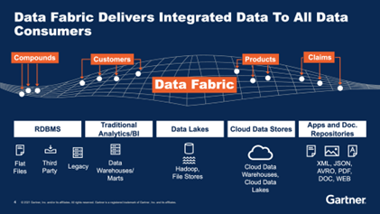
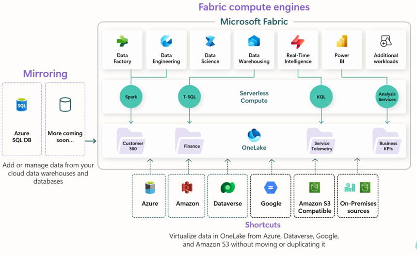

<center>

# DATA FABRIC

**Ecrit par Etienne ZONON**  
_Data Scientist - Ingénieur avec un peu plus de 6 ans d’expérience notamment dans le domaine des télécommunications._  
Je vous aide à tirer le meilleur de vos données.

## Aujourd’hui, nous allons parler de Data Fabric

### 🗓️ Agenda :

 [I. Qu’est-ce qu’un Data Fabric](#i-quest-ce-quun-data-fabric)

 [II. Bénéfices d’un Data Fabric](#ii-bénéfices-dun-data-fabric)

 [III. Composants d’un Data Fabric](#iii-composants-dun-data-fabric)

 [IV. Différences clés avec un Data Management Traditionnel](#iv-différences-clés-avec-un-data-management-traditionnel)

 [V. Avantages de Microsoft Fabric](#v-avantages-de-microsoft-fabric)


</center>


**Dans les quelques lignes qui suivent, nous allons parler de Data et de plateforme unifiée.**
Aujourd’hui, les données sont partout… mais rarement accessibles simplement.
Entre silos techniques, complexité d’intégration, gouvernance dispersée et manque d’agilité, les entreprises peinent à exploiter pleinement la valeur de leurs données.
C’est dans ce contexte qu’émerge le Data Fabric : une nouvelle approche qui connecte intelligemment toutes les données de l’organisation, peu importe leur source ou leur emplacement.
**Mais de quoi parle-t-on exactement ? Et pourquoi le Data Fabric, notamment à travers des solutions comme Microsoft Fabric, change-t-il profondément la donne ?**


## I. Qu’est-ce qu’un Data Fabric

Data Fabric est une approche d’architecture unifiée qui permet l’accès aux donnés, leur intégration, leur management, leur sécurité autour de plusieurs environnements (Cloud, on-premises, des devices IoT). Il permet de connecter des sources de données dispersées pour offrir une vision cohérente, gouvernée et facilement exploitables. Grâce à différents composants, il permet de suivre le versionning et la gouvernance des donnés en simplifiant la circulation des données dans l’entreprise, sans devoir les déplacer massivement. Les équipes peuvent donc trouver, manipuler, utiliser et valoriser les données beaucoup plus rapidement.

## II. Bénéfices d’un Data Fabric

1. **Accès unifié et temps réel aux données**

- Permet de **connecter différentes sources de données** (cloud, on-premises, edge).
- Facilite un **accès cohérent et rapide** aux données, sans déplacer celles-ci.

2. **Automatisation de la gestion des données**

- **Automatise les processus** tels que l’intégration, la qualité des données et la gouvernance.
- Utilise l’IA et le machine learning pour améliorer en continu la gestion des données.

3. **Vue unifiée et fiabilité des données**

- Offre une **vision globale et cohérente** des données.
- Améliore la **qualité** et la **fiabilité** des informations utilisées pour la prise de décision.

4. **Renforcement de la sécurité et de la gouvernance**

- Met en œuvre des politiques de **sécurité centralisée** et de **protection des données.**
- Assure une meilleure conformité aux réglementations (RGPD, etc.).

 5. **Accélération de l’innovation et de l’agilité**

- Réduit le temps nécessaire pour **développer de nouveaux services** basés sur les données.
- Facilite l’**expérimentation** et l’**adoption rapide** des nouvelles technologies.

 6. **Optimisation des coûts**

- Évite la duplication inutile des données.
- Réduit les coûts liés à l’intégration et à la gestion de systèmes disparates

## III. Composants d’un Data Fabric

A cette étape, il serait légitime de se demander quelles sont les composants d’un Data Fabric
```text
-------------------------------------------------------------------------------------------------------
| ## | Composant                                     |          Description                            |
|---|-----------------------------------------------|------------------------------------------------ |
| 1 | Connecteurs de données                        | Se connectent à différentes sources de données  |
|   |                                               | (bases de données, API, stockage cloud, systèmes|    
|   |                                               | hérités…).                                      |
-------------------------------------------------------------------------------------------------------                                   
| 2 | Catalogue de données (Data Catalog)           | Inventaire centralisé des datasets avec         |
|   |                                               |   métadonnées, descriptions, traçabilité.       |
-------------------------------------------------------------------------------------------------------            
| 3 | Moteur d’intégration (Data Integration)       | Intègre et combine les données de sources       |
                                                    |   variées (ETL/ELT, streaming, batch).          |
-------------------------------------------------------------------------------------------------------              
| 4 | Gouvernance et sécurité                       | Gestion des accès, règles de confidentialité    |
                                                    |  (RGPD…), data lineage.                         |  
-------------------------------------------------------------------------------------------------------                        
| 5 | Virtualisation de données                     | Permet l’accès aux données en temps réel sans   |
|   |                                               |                  duplication physique.          |
-------------------------------------------------------------------------------------------------------                             
| 6 | Intelligence artificielle / Machine Learning  | Moteurs IA/ML pour enrichir les métadonnées,    |
                                                    |          recommander des données pertinentes.   | 
-------------------------------------------------------------------------------------------------------           
| 7 | APIs et services DataOps                      | Fournit un accès automatisé aux données pour    |
|   |                                               |           les applications et workflows.        | 
-------------------------------------------------------------------------------------------------------                
| 8 | Observabilité des données (Data Observability)| Surveillance de la qualité, fraîcheur et        |
                                                    |                         cohérence des données.  |         
-------------------------------------------------------------------------------------------------------                    
| 9 | Interfaces utilisateur                        | Interfaces pour les data analysts, data         |
|   |                                               | scientists, métiers… (ex: requêtes SQL,         |
|   |                                               |exploration visuelle).                           |  
-------------------------------------------------------------------------------------------------------
```



Figure1: https://www.k2view.com/hs-fs/hubfs/Data%20fabric%20diagram%20from%20Gartner-1.png?width=2000&name=Data%20fabric%20diagram%20from%20Gartner-1.png 


## IV. Différences clés avec un Data Management Traditionnel
Voyons donc dans un tableau les différences entre la façon de gérer les données d’une façon traditionnelle et avec un Data Fabric

```text
---------------------------------------------------------------------------------------------------
| Critère                   | Traditional Data Management       |     Data  Fabric                 | 
|---------------------------|-----------------------------------|----------------------------------|
| Architecture              | Silos de données (Data Warehouse, |Architecture   unifiée            |
|                           |   Data Lake séparés)              |         distribuée               |
----------------------------------------------------------------------------------------------------
| Accès aux données  manuel | Localisé (par système), souvent   |Accès global et automatisé à      |
|                           | manuel                            |toutes les sources                |
---------------------------------------------------------------------------------------------------                            
| Intégration des données   | ETL batch, souvent rigide et      |Intégration intelligente et       |
|                           | centralisé                        | automatisée (batch + temps réel) |
----------------------------------------------------------------------------------------------------
| Catalogue et métadonnées  | Généralement séparés et peu       | Catalogue dynamique enrichi par  | 
| exploités                 | l'IA                             | l'IA
----------------------------------------------------------------------------------------------------
| Gouvernance               | Isolée par système(data warehouse |Gouvernance centralisée           |
|                           |   , CRM, etc.)                    |        et transverse             |
----------------------------------------------------------------------------------------------------
| Découverte des données    | Manuelle, lente, limitée aux      |Découverte assistée par IA/ML     |
|                           | experts                           |                                  |
---------------------------------------------------------------------------------------------------  
| Virtualisation des données| Rarement utilisé                  |Virtualisation native             |
                            |                                   |   (accès en temps réel)          |  
----------------------------------------------------------------------------------------------------
| Déploiement               | Principalement on-premise ou cloud|Multi-cloud, hybride, on-prem et  |
                            | par projet                        |   SaaS                           |
----------------------------------------------------------------------------------------------------
| Agilité                   | Peu flexible , modification       | Très agile, rapide à adapter     |
|                           | complexe                          |                                  |
----------------------------------------------------------------------------------------------------
| Support de l'IA/ML dans   |  Faible ou isolé                  | Intégré dans l'architecture      |  
---------------------------------------------------------------------------------------------------- 
| Public cible              | Équipes IT techniques             | IT + Data Engineers + Métiers    |
|                           |                                   | Data Scientists                  |
----------------------------------------------------------------------------------------------------
```


Figure2: https://learn.microsoft.com/en-us/fabric/fundamentals/media/microsoft-fabric-overview/onelake-architecture.png##lightbox

## V. Avantages de Microsoft Fabric
Microsoft Fabric est la plateforme Data Fabric de Microsoft, nous pouvons donc nous demander quelles sont les avantages d’utiliser Microsoft Fabric. Les avantages sont énormes mais citons-en quelques un : 

1-	**Plateforme unifiée de bout en bout**

- Intègre ingestion, stockage (Data Lake OneLake), transformation, modélisation, visualisation (Power BI) → tout en un.
- Moins de silos entre équipes (data engineers, data analysts, BI, data scientists).

2-	**Support natif pour un modèle "Data Mesh"**

- Fabric permet aux équipes métier (domain teams) de posséder leurs propres data products → approche décentralisée de la donnée.
- Chaque équipe peut gérer ses propres tables et modèles dans un Lakehouse → avec gouvernance globale.
- Favorise l’autonomie des équipes (principe clé du Data Mesh).

3-	**Gouvernance centralisée et automatisée**

- Utilisation native de Microsoft Purview pour la gouvernance.
- Data lineage, catalogue des données, politiques de sécurité → intégrés sans effort.

4-	**Optimisé pour le multi-cloud / hybride**

- OneLake = stockage cloud indépendant de l’environnement (Azure, multicloud).
- Possibilité de connecter aussi à d’autres clouds, bases existantes.

5-	**Simplicité et productivité**

- Utilisation facile pour toutes les parties prenantes : notebooks Spark, SQL, Power BI, pipeline Data Factory.
- Moins besoin de maintenir une stack complexe d’outils séparés.

6-	**Intelligence augmentée / IA intégrée**

- Intégration de Copilot pour aider à la découverte des données, génération de code, requêtes assistées.
- IA/ML intégrée avec Synapse ML, Azure ML.

7-	**Support natif du format Delta Lake**

- Toutes les tables sont en Delta Lake → haute performance, versioning, ACID.

8-	**Écosystème Microsoft (Pour Microsoft Fabric)**

- Intégration naturelle avec Power BI, Microsoft 365, Azure Active Directory.
- Sécurité et conformité Microsoft.


## Conclusion 
Avec Microsoft Fabric, je propose une approche moderne et unifiée de la gestion des données. Cette plateforme Data Fabric native intègre ingestion, stockage, transformation, gouvernance et visualisation — avec Power BI embarqué pour un reporting en temps réel. Elle permet aux équipes métiers d’accéder aux bonnes données au bon moment, en cohérence avec les principes du Data Mesh. Plus besoin d’assembler 10 outils différents : Fabric connecte l’ensemble de l’écosystème Microsoft et open source. Une vraie solution pour accélérer la valeur business des données, de manière agile et gouvernée.
